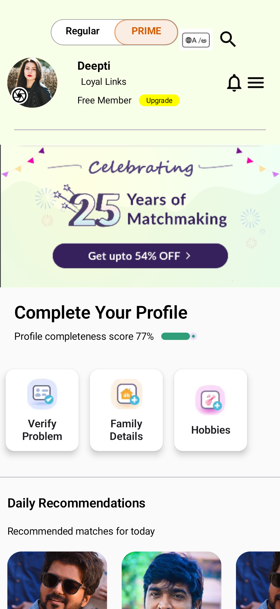

# Demo Telugu Matrimony App (Jetpack Compose)

## 📱 Project Overview

Demo Telugu Matrimony App is a sample Android application built using **Jetpack Compose**. It demonstrates a modern matrimonial platform for Telugu users, focusing on clean UI, smooth navigation, and common matrimonial app features.

---

## 🧩 Screens Included

The project contains the following screens inside the **`screens`** package:


### 1. Splash / Landing Screen

* App branding (LoyalLinks)
* Telugu language support button
* Options for **Create Profile** and **Login**

### 2. Login Screen (OTP)

* Mobile number input with country code
* OTP-based authentication flow
* Option to login using password

### 3. Home / Dashboard Screen

* User profile summary
* Membership status (Free / Prime)
* Profile completion progress
* Upgrade membership option

## 🛠 Tech Stack

* **Language:** Kotlin
* **UI Toolkit:** Jetpack Compose
* **State Management:** Compose State / ViewModel

---

## 📂 Project Structure (Simplified)

```
com.example.telugumatrimony
└───com
    └───my
        └───repo
            │-----MainActivity.kt
            │-----Test.kt
            │-----ViewModels.kt
            │
            ├───screens
            │   ├───main
            │   │-----Controller.kt
            │   │-----DashBoard.kt
            │   │-----Items.kt
            │   │
            │   └───start
            │----------CreateProfile.kt
            │----------LoginWithOtp.kt
            │----------StartScreen.kt
```

---

## ✨ Features

* Modern Compose UI
* OTP-based login flow
* Profile creation & completion tracking
* Match recommendations UI

---

## 🚀 Purpose

This project is created for **learning, demo, and portfolio purposes**, showcasing Android Jetpack Compose skills and real-world matrimonial app UI flows.

---

## 📌 Note

This is a **demo application**. Backend integration and real authentication are not included.

---

👨‍💻 Developed as a practice project to demonstrate modern Android development using Jetpack Compose.
